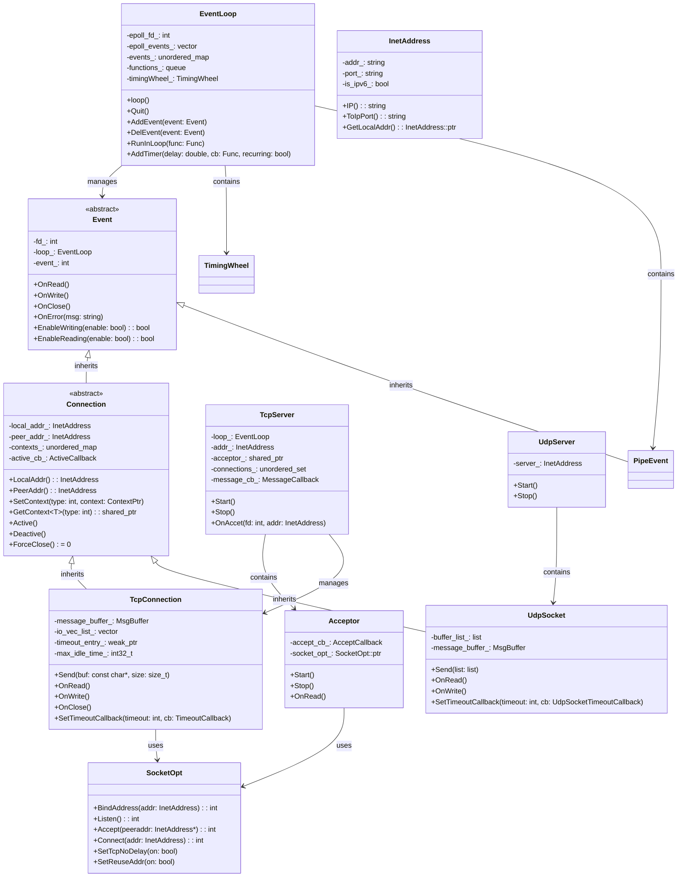

# 事件循环

```mermaid
classDiagram
    class EventLoop {
        +loop()
        +Quit()
        +AddEvent(event: Event)
        +DelEvent(event: Event)
        +RunInLoop(func: Func)
        +AddTimer(delay: double, cb: Func, recurring: bool)
        -epoll_fd_: int
        -epoll_events_: vector<epoll_event>
        -events_: unordered_map<int, Event>
        -functions_: queue<Func>
        -timingWheel_: TimingWheel
    }

    class Event {
        <<abstract>>
        +OnRead()
        +OnWrite()
        +OnClose()
        +OnError(msg: string)
        +EnableWriting(enable: bool): bool
        +EnableReading(enable: bool): bool
        -fd_: int
        -loop_: EventLoop
        -event_: int
    }

    class Connection {
        <<abstract>>
        +LocalAddr(): InetAddress
        +PeerAddr(): InetAddress
        +SetContext(type: int, context: ContextPtr)
        +GetContext~T~(type: int): shared_ptr<T>
        +Active()
        +Deactive()
        +ForceClose() = 0
        -local_addr_: InetAddress
        -peer_addr_: InetAddress
        -contexts_: unordered_map<int, ContextPtr>
        -active_cb_: ActiveCallback
    }

    class TcpServer {
        +Start()
        +Stop()
        +OnAccet(fd: int, addr: InetAddress)
        -loop_: EventLoop
        -addr_: InetAddress
        -acceptor_: shared_ptr<Acceptor>
        -connections_: unordered_set<TcpConnectionPtr>
        -message_cb_: MessageCallback
    }

    class TcpConnection {
        +Send(buf: const char*, size: size_t)
        +OnRead()
        +OnWrite()
        +OnClose()
        +SetTimeoutCallback(timeout: int, cb: TimeoutCallback)
        -message_buffer_: MsgBuffer
        -io_vec_list_: vector<iovec>
        -timeout_entry_: weak_ptr<TimeoutEntry>
        -max_idle_time_: int32_t
    }

    class UdpServer {
        +Start()
        +Stop()
        -server_: InetAddress
    }

    class UdpSocket {
        +Send(list: list<UdpBufferNodePtr>)
        +OnRead()
        +OnWrite()
        +SetTimeoutCallback(timeout: int, cb: UdpSocketTimeoutCallback)
        -buffer_list_: list<UdpBufferNodePtr>
        -message_buffer_: MsgBuffer
    }

    class Acceptor {
        +Start()
        +Stop()
        +OnRead()
        -accept_cb_: AcceptCallback
        -socket_opt_: SocketOpt::ptr
    }

    class SocketOpt {
        +BindAddress(addr: InetAddress): int
        +Listen(): int
        +Accept(peeraddr: InetAddress*): int
        +Connect(addr: InetAddress): int
        +SetTcpNoDelay(on: bool)
        +SetReuseAddr(on: bool)
    }

    class InetAddress {
        +IP(): string
        +ToIpPort(): string
        +GetLocalAddr(): InetAddress::ptr
        -addr_: string
        -port_: string
        -is_ipv6_: bool
    }

    EventLoop --> Event : manages
    EventLoop --> TimingWheel : contains
    Event <|-- Connection : inherits
    Connection <|-- TcpConnection : inherits
    Connection <|-- UdpSocket : inherits
    TcpServer --> Acceptor : contains
    TcpServer --> TcpConnection : manages
    UdpServer --> UdpSocket : contains
    Acceptor --> SocketOpt : uses
    TcpConnection --> SocketOpt : uses
    EventLoop --> PipeEvent : contains
    Event <|-- PipeEvent : inherits
```